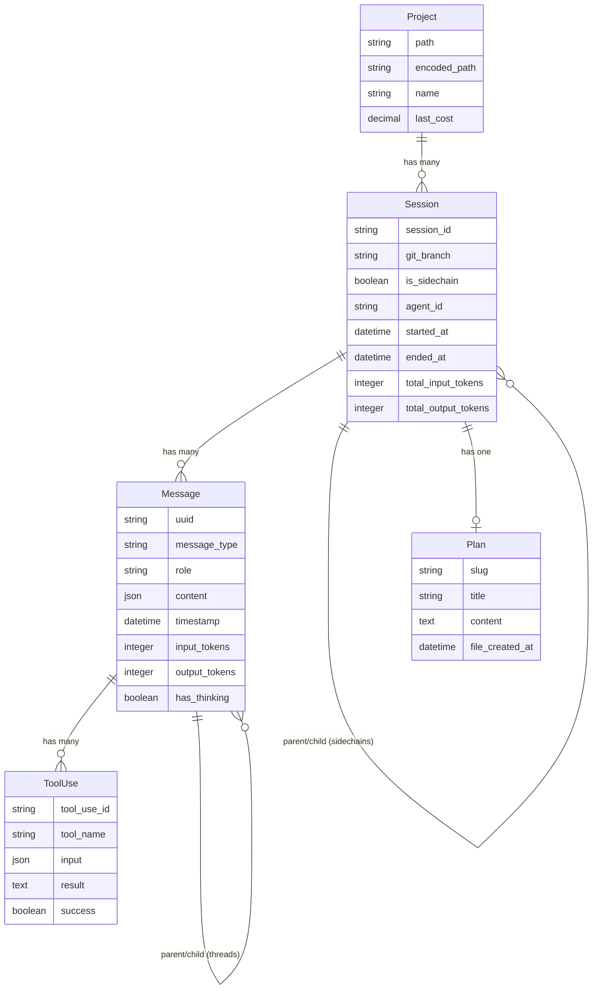

# Claude Explorer

A Rails app for browsing and visualizing your Claude Code conversation history. Parses local Claude data files and provides a web UI to explore projects, sessions, messages, and tool usage patterns.

## Features

- **Browse Projects** - View all projects where you've used Claude Code
- **Session History** - See all conversations with timestamps, branches, and token usage
- **Threaded Messages** - View full conversation threads with parent/child relationships
- **Plan Viewer** - Browse implementation plans created during plan mode sessions
- **Tool Analytics** - Analyze tool usage patterns across all sessions
- **Sidechain Navigation** - Explore agent subprocesses spawned during conversations

## Requirements

- Ruby 3.2+
- Rails 8.1
- SQLite 3

## Setup

```bash
# Install dependencies
bundle install

# Create database
bin/rails db:create db:migrate

# Import your Claude data
bin/rails claude_data:import

# Start the server
bin/dev
```

Visit `http://localhost:3001` to explore your Claude Code history.

## How It Works

Claude Explorer reads data from your local Claude Code installation:

- `~/.claude.json` - Project configurations and metadata
- `~/.claude/projects/<encoded-path>/*.jsonl` - Conversation histories
- `~/.claude/plans/*.md` - Implementation plans from plan mode

The importer parses JSONL files, extracts messages, tool uses, and session metadata, then stores everything in SQLite for fast querying. Plans are linked to sessions by matching the slug identifier found in conversation records.

## Data Model



| Model | Description |
|-------|-------------|
| Project | A directory where Claude Code was used |
| Session | A single conversation (main or agent sidechain) |
| Message | User or assistant message with content blocks |
| ToolUse | Individual tool invocation (Read, Write, Bash, etc.) |
| Plan | Implementation plan created during plan mode |

## Development

```bash
bin/dev                    # Start dev server
bin/rails test             # Run tests (156 tests)
bin/rails console          # Rails console
bin/rubocop -a             # Auto-fix lint issues
```

## Importing Data

Import all Claude data:
```bash
bin/rails claude_data:import
```

Or use the "Import All" button in the web UI navigation.

## Stack

- **Rails 8.1** with Propshaft asset pipeline
- **SQLite** for database
- **Hotwire** (Turbo + Stimulus) for interactivity
- **Plain CSS** - no frameworks or build step
